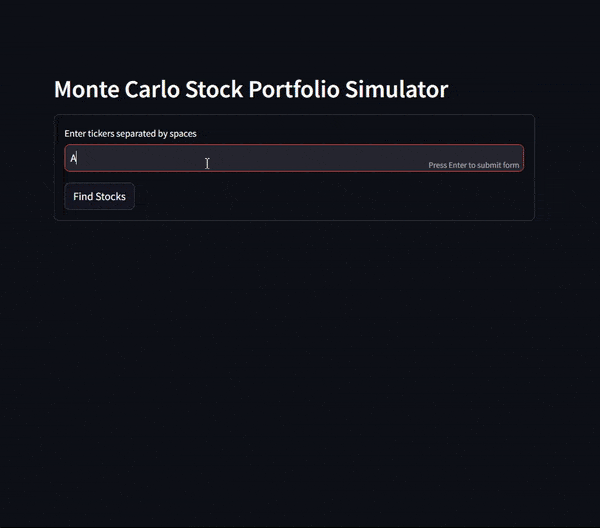

# Monte Carlo Simulator for Stock Portfolios
A streamlit app which runs Monte Carlo simulations on a given stock portfolio

[Try the app](https://mc-stocks.streamlit.app/)
## Features
- Perform Monte Carlo simulations for stock portfolios
- Customise a stock portfolio and simulate future returns
- Correlate stock returns using Cholesky decomposition
- Display key portfolio metrics: average, minimum, and maximum portfolio values
- Show Value at Risk (VaR) for the simulated portfolios
- Plot histograms of simulated outcomes
## Method
### Overview
For each stock entered by the user, the average return over the last half year is collected through Yahoo Finance. Monte Carlo simulations are ran by simulating the return of each stock each days as random normal variables taking into account not only the mean return but covariance between each stock. Once the simulations are ran, summary statistics are calculated as well as paths of cumulative return for each simulation.

### Stock Data
Each ticker the user enters is searched on Yahoo Finance through the yfinance python libary. Due to limitations with using yfinance in combination with streamlit, only yf.download() can be reliably used - yf.info() is sometimes blocked by streamlit.

The daily close price of each stock as a percentage change from yesterday is stored as a matrix. From this a covariance matrix is computed, as well as its Cholesky decomposition to produce the lower triangle needed to tranform random independent variables to correlated ones. Also from the original matrix the average return is computed to center the random variable.

### Simulation
For each simulation, a matrix of random independent standard normal variables are generated: one per stock per day of simulation. By taking the dot product of this matrix and the lower triangle of the covariance matrix, these random variables transform into correlated variables that represent the joint movement of the returns of multiple stocks. For each stock, its mean return is added to each of these numbers to center the return around what has been historically observed.

Each day of the simulation, the daily return is computed as the weighted sum of the return of each stock. This is then multiplied by yesterdays portfolio value to give todays portfolio value. This continues until the end of the simulation, where a graph is shown tracking the value of the portfolio every day for each simulation.

### Metrics and Statistics
The results of each simulation is stored in a master dataframe, one row per simulation. This table is used to compute various relevant statistics, such as:
- Mean, minimum and maximum value after final day: What is the expected return of this porfolio given the simulation, as well as the best and worse case scenarios
- Volatility: How much can the final value of the portfolio vary?
- Distribution (histogram): How are the returns distributed, what is the likelihood of different returns
- Upper/Lower quartile, median: Better understand distribution and potential downside risks
- Value at Risk: Insight into what is at stake in worst-case scenarios

## Technologies Used
- streamlit - UI design and hosting
- pandas - Data manipulation
- yfinance - Stock data
- plotly - Graphing
- numpy - Cholesky decomposition
